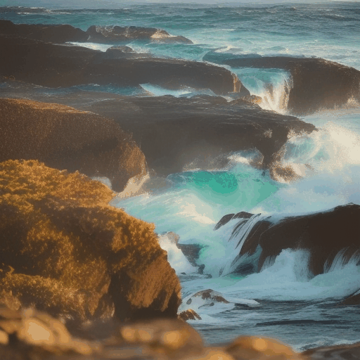
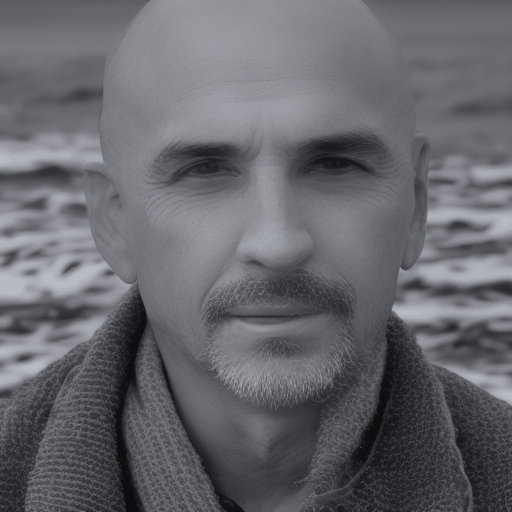
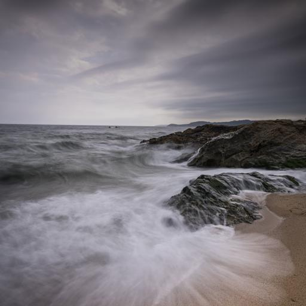
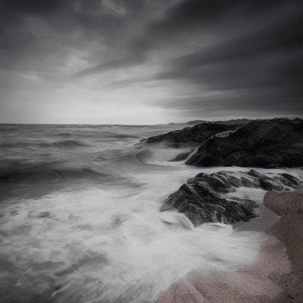
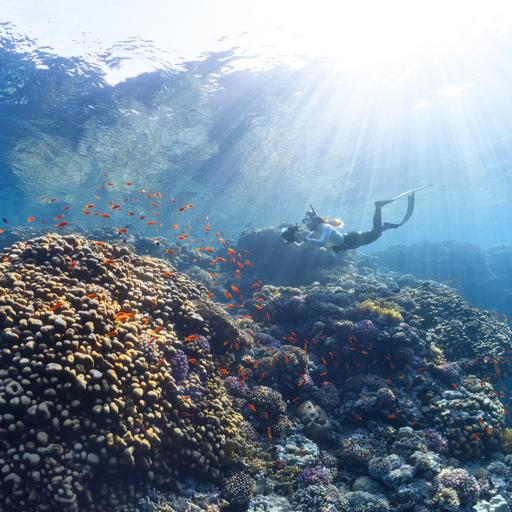
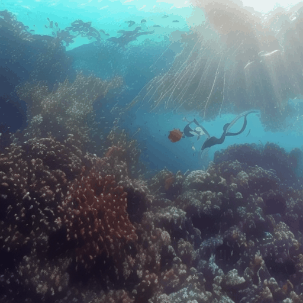
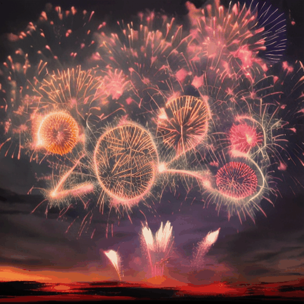
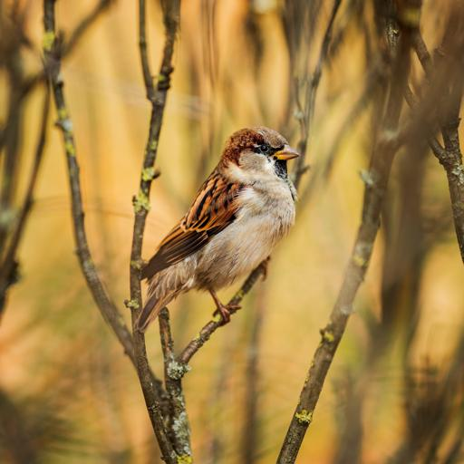
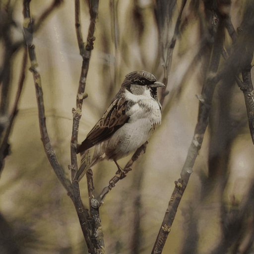

# Animatediff with controlnet
### Descirption: Add a controlnet to animatediff to animate a given image.

<table class="center">
    <tr>
    <td></td>
    <td></td>
    <td></td>
    <td></td>
    </tr>
</table>
<table class="center">
    <tr>
    <td></td>
    <td></td>
    <td></td>
    <td></td>
    </tr>
</table>
<table class="center">
    <tr>
    <td></td>
    <td></td>
    <td></td>
    <td></td>
    </tr>
</table>

[Animatediff](https://github.com/guoyww/AnimateDiff) is a recent animation project based on SD, which produces excellent results. This repository aims to enhance Animatediff in two ways:

1. Animating a specific image: Starting from a given image and utilizing controlnet, it maintains the appearance of the image while animating it.

2. Upgrading the previous code's diffusers version: The previous code used diffusers version 0.11.1, and the upgraded version now uses diffusers version 0.21.4. This allows for the extension of Animatediff to include more features from diffusers, such as controlnet.

#### TODO：

- [x] Release the train and inference code
- [x] Release the controlnet [checkpoint](https://huggingface.co/crishhh/animatediff_controlnet)
- [ ] Reduce the GPU memory usage of controlnet in the code
- [ ] Others

#### How to start (inference)

1. Prepare the environment

   ```python
   conda env create -f newanimate.yaml
   # Or
   conda create --name newanimate python=3.10
   pip install -r requirements.txt
   ```

2. Download the models according to [AnimateDiff](https://github.com/guoyww/AnimateDiff),  put them in ./models. Download the controlnet [checkpoint](https://huggingface.co/crishhh/animatediff_controlnet), put them in ./checkpoints.

3. Prepare the prompts and initial image（Prepare the prompts and initial image）

   Note that the prompts are important for the animation, here I use the MiniGPT-4, and the prompt to [MiniGPT-4](https://github.com/Vision-CAIR/MiniGPT-4) is "Please output the perfect description prompt of this picture into the StableDiffusion model, and separate the description into multiple keywords with commas"

4. Modify the  YAML file (location: ./configs/prompts/v2/5-RealisticVision.yaml)

5. Run the demo

   ```python
   python animatetest.py
   ```

#### How to train

1. Download the datasets (WebVid-10M)

   ```python
   python download_data.py
   ```

2. Run the train

   ```python
   python train.py
   ```

#### Limitations

1. The current ControlNet version has been trained on a subset of WebVid-10M, comprising approximately 5,000 video-caption pairs. As a result, its performance is not very satisfactory, and work is underway to train ControlNet on larger datasets.
2. Some images are proving challenging to animate effectively, even when prompted with corresponding instructions. These difficulties persist when attempting to manipulate them using Animatediff without the use of ControlNet.
3. It is preferable for the image and its corresponding prompts to have a stronger alignment for better results.

#### Future

1. Currently, the ControlNet in use is 2D level, and our plan is to expand it to 3D while incorporating the motion module into the ControlNet.
2. We aim to incorporate a trajectory encoder into the ControlNet branch to control the motion module. Even though this might appear to potentially conflict with the existing motion module, we still want to give it a try.

#### Some Failed Attempts (Possibly Due to Missteps):

1. Injecting the encoded image by VAE into the initial latent space doesn't seem to work, it generates videos with similar styles but inconsistent appearances.
2. Performing DDIM inversion on the image to obtain noise and then denoising it, while seemingly drawing inspiration from common image editing methods, doesn't yield effective results based on our observations.

The code in this repository is intended solely as an experimental demo. If you have any feedback or questions, please feel free to open an issue or contact me via email at crystallee0418@gmail.com.

The code in this repository is derived from Animatediff and Diffusers.
